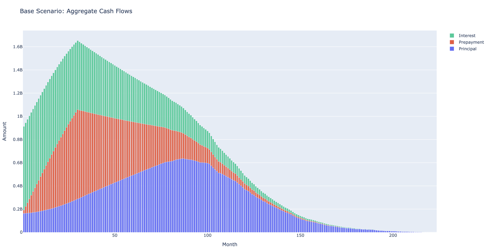
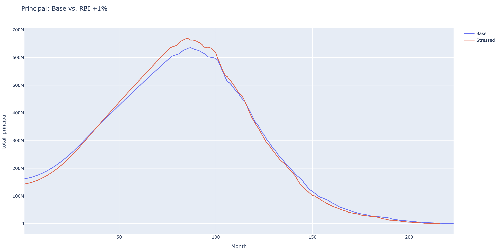
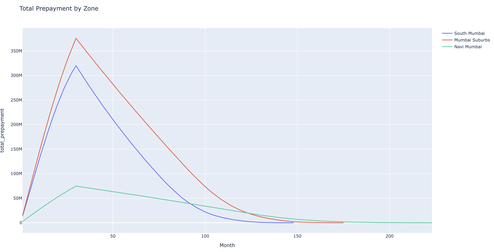
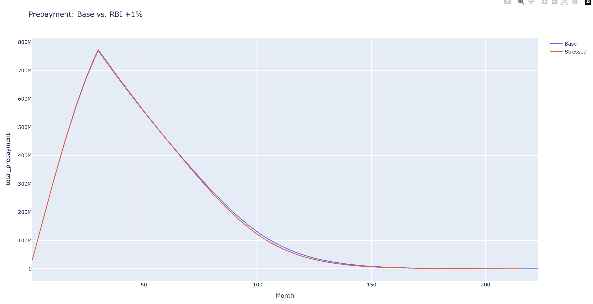
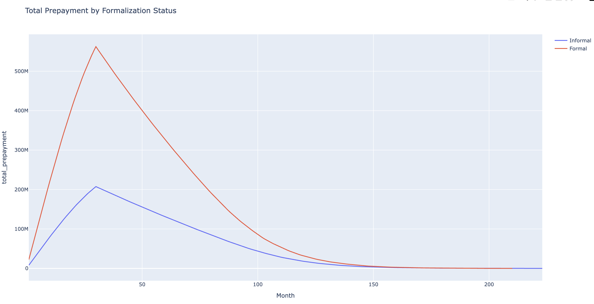

# Mumbai MBS Simulator (High-Performance Python/Rust Hybrid)

A high-performance, loan-level Mortgage-Backed Securities (MBS) simulator specifically tailored to the Mumbai residential housing market. This project uses a hybrid "Python + Rust" architecture to achieve best-in-class performance while maintaining Python's ease of use for high-level orchestration.

## Architecture

### Python Front-end (Orchestrator)
- **Data Loading**: Uses Polars for fast CSV reading and initial validation
- **Validation**: Pydantic models for data schema validation
- **Dashboard**: Plotly-based interactive visualizations
- **High-level Logic**: Coordinates the overall simulation workflow

### Rust Back-end (Simulation Engine)
- **Core Computation**: All performance-critical calculations in native Rust
- **Cash Flow Generation**: Per-loan amortization schedules with prepayment modeling
- **PSA Modeling**: Mumbai-specific prepayment speed calculations
- **Metrics Calculation**: Duration, convexity, and average life computations
- **Stress Testing**: RBI rate shifts, price shocks, and zone-specific defaults

### Zero-Copy Integration
- **pyo3-polars**: Enables seamless data transfer between Python and Rust
- **No Serialization**: Polars DataFrames pass directly from Python to Rust
- **Native Performance**: Rust operates on data at native speed

## Features

### Core Simulation
- Loan-level cash flow simulation for Mumbai housing data
- PSA-based prepayment modeling with local market adjustments
- Vectorized calculations using Polars for maximum performance

### Risk Analytics
- Average life, duration, and convexity calculations
- Cash flow waterfall analysis
- Stress testing capabilities for various market scenarios

### Mumbai-Specific Modeling
- Zone-based prepayment multipliers (South Mumbai, Mumbai Suburbs, Navi Mumbai)
- Formalization status impact on prepayment behavior
- Price appreciation rate sensitivity analysis

### Stress Testing
- RBI rate shift scenarios
- Property price shock analysis
- Zone-specific default surge modeling
- Combined stress scenario analysis

## Installation

### Prerequisites
- Python 3.8+
- Rust (latest stable)
- uv (recommended) or pip

### Setup

1. **Clone the repository**:
   ```bash
   git clone <repository-url>
   cd Mumbai-MBS
   ```

2. **Install Python dependencies**:
   ```bash
   # Using uv (recommended)
   uv pip install -r requirements.txt
   
   # Or using pip
   pip install -r requirements.txt
   ```

3. **Build the Rust engine**:
   ```bash
   maturin develop
   ```

4. **Run the simulation**:
   ```bash
   python main.py
   ```

## Usage

### Basic Simulation
```python
from mbs.loader import load_loans
from mbs.model import aggregate_cash_flows, compute_mbs_metrics

# Load loan data
loans_df = load_loans("data/sheet1.csv")

# Generate cash flows using Rust engine
cash_flows_df = aggregate_cash_flows(loans_df)

# Compute MBS metrics
metrics = compute_mbs_metrics(cash_flows_df)
print(f"Average Life: {metrics['average_life']:.2f} years")
print(f"Duration: {metrics['duration']:.2f} years")
print(f"Convexity: {metrics['convexity']:.4f}")
```

### Stress Testing
```python
from mbs.stress import apply_rbi_rate_shift, apply_price_shock

# RBI rate +1% stress
stressed_loans = apply_rbi_rate_shift(loans_df, 1.0)
stressed_flows = aggregate_cash_flows(stressed_loans)
stressed_metrics = compute_mbs_metrics(stressed_flows)

# Price appreciation -5% stress
price_shocked_loans = apply_price_shock(loans_df, -0.05)
```

### Visualization
```python
from mbs.dashboard import plot_cash_flows, compare_scenarios

# Plot base scenario cash flows
plot_cash_flows(cash_flows_df)

# Compare base vs stressed scenarios
compare_scenarios(cash_flows_df, stressed_flows, 
                 metric='total_prepayment', 
                 title="Prepayment: Base vs RBI +1%")
```

## Data Format

The simulator expects CSV data with the following columns:
- `loan_id`: Unique loan identifier
- `amount`: Loan principal amount
- `interest_rate`: Annual interest rate (%)
- `term_months`: Loan term in months
- `zone`: Mumbai zone ("South Mumbai", "Mumbai Suburbs", "Navi Mumbai")
- `origination_date`: Loan origination date
- `price_appreciation_rate`: Annual property price appreciation rate
- `formalization_status`: "Formal" or "Informal"
- `rbi_rate_at_origination`: RBI repo rate at loan origination

## Performance

The Rust engine provides significant performance improvements:
- **10-100x faster** cash flow generation compared to pure Python
- **Zero-copy** data transfer between Python and Rust
- **Vectorized operations** using polars-rs for maximum efficiency
- **Memory efficient** processing of large loan portfolios

## Development

### Building from Source
```bash
# Development build
maturin develop

# Release build
maturin build --release
```

### Running Tests
```bash
# Python tests
pytest

# Rust tests
cargo test
```

## Technology Stack

- **Python**: High-level orchestration and user interface
- **Rust**: Core simulation engine
- **Polars**: High-performance DataFrames (Python & Rust)
- **PyO3**: Python-Rust integration
- **pyo3-polars**: Zero-copy DataFrame transfer
- **Maturin**: Rust-Python build tool
- **Plotly**: Interactive visualizations
- **Pydantic**: Data validation

## Screenshots

### Cash Flow Analysis


### Payment Analysis


### Prepayment Modeling


### Stress Testing Results


### Formalization Impact


## License

[Add your license information here]

## Contributing

[Add contributing guidelines here] 